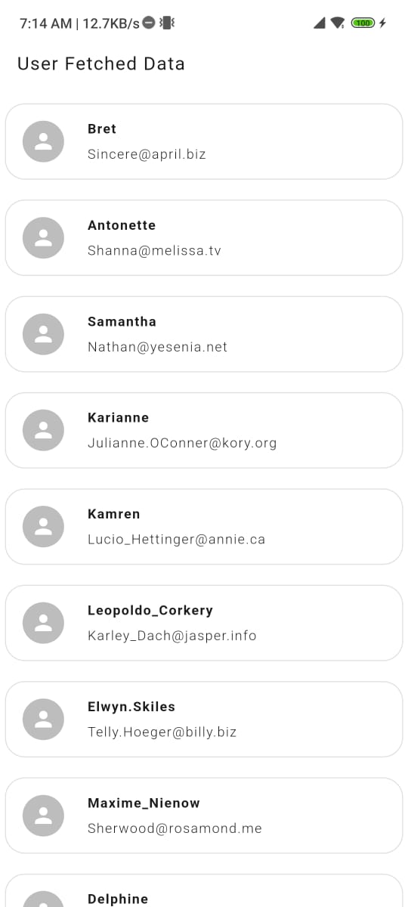
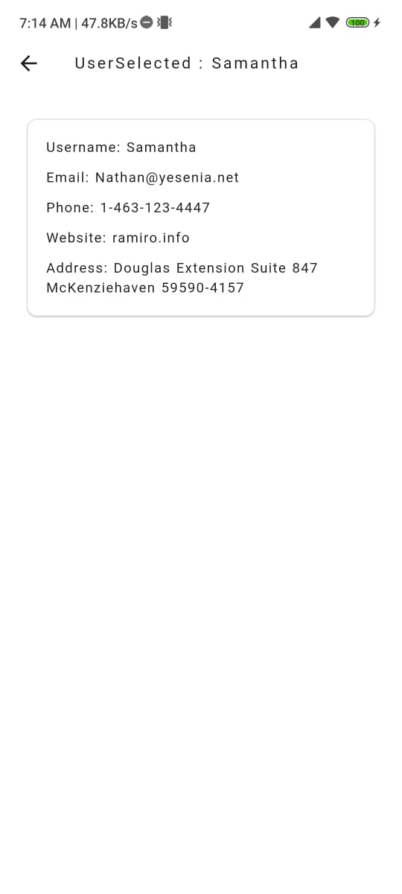
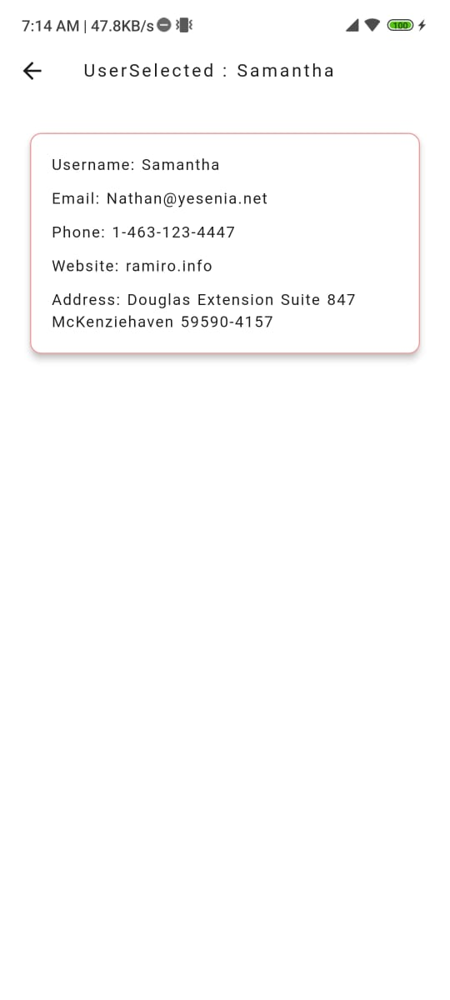

# Demo Project

A new Flutter project which fetch User Details from an API.

## How to use this Application

1. **Clone the repository:**
   ```bash
   git clone https://github.com/Vishvenderraj/Demo-Project.git
   ```

2. **Navigate to the project directory:**
   ```bash
   cd Demo-Project
   ```

3. **Install dependencies:**
   ```bash
   flutter pub get
   ```

4. **Run the app:**
   ```bash
   flutter run
   ```

## Assumptions and Decisions

-  The app is designed to work on Android
- Used the `Provider` package for state management for simplicity and scalability.
- Add a Interactive UI, to clearly portrayed the selected tile
- Application is Completely responsive
- Made small interaction to made app look better

## Screenshots





